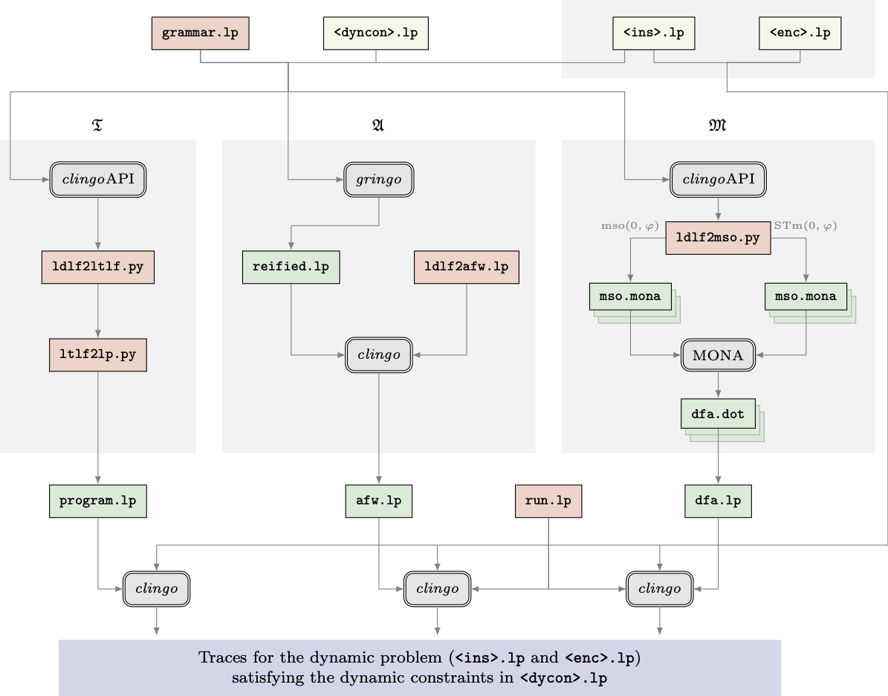

# Translating temporal/dynamic formulas into Alternating Automata using ASP

This project contains the ASP encodings to transform temporal logic formulas into alternating automata which allow validation and generation of traces.

## Dependencies 

Update git-submodules. We use `https` instead of `sh` to facilitate the installation in the cluster.

dot2tex

```shell
$ git submodule update --init --recursive
```

Install [clingo](https://potassco.org/doc/start/) preferably using `conda`.
We use version `5.4.0`

```shell
$ conda install -c potassco clingo
```

For the tests, plotting and visualization of automata we require an installation of python version `3.7.3` and the following dependencies that can be installed using `pip`:
```shell
$ pip install networkx
$ pip install pygraphviz
$ pip install tikzplotlib
```

The installation can be checked my running the tests.

```
$ make tests -B
```

The successfully output will look like:
****
```
Running 'del' tests.......
----------------------------------------------------------------------
Ran 4 tests in 8.119s

OK
Running 'tel' tests........
----------------------------------------------------------------------
Ran 5 tests in 6.402s

OK
```


## Workflow 

We work with two different types of formulas:
- **TEL** (Linear Temporal Logic over finite traces) LTLf
-  **DEL** (Linear Dynamic Logic over finite traces) LDLf

We will use in this document `del` as an example but it can be substituted by `tel`.

We think of this approach in two steps:
1.  Generation of a declarative representation of an automaton from a theory formula representing a temporal formula. All files for this step are found in the directory [formula_to_automaton](./formula_to_automaton).
2.  Using a declarative representation of an automaton, we check if a trace is valid in the automaton by generating all accepted runs. All files for this step are found in the directory  [automata_run](./automata_run). This process has two options.
    1. The trace is explicitly provided via facts, or an external encoding (such as asprilo). 
    2. Traces are generated using a choice rule, thus computing all valid traces for a given horizon.



We now explain the encodings used and provide examples. The presented commands used the following share arguments:

- `$LOGIC` is either 'tel' or 'del'.
- `$APP` the application domain name. A directory with this name must exist inside the folder `\env`.
- `$CONSTRAINT` the name of the file for the temporal constraint without extension. Multiple constraints for the same type of logic can be provided.
- `$INSTANCE` the full path to the encoding of the instance for the planning problem. An empty file can also be provided.
- `$PATH_OUT`  directory to store output files are stored in which should be constructed as `./outputs/$APP/$LOGIC/$CONSTRAINT/$NAME_INSTANCE` where `$NAME_INSTANCE` is the name of the instance file. This directory will save: Reified format, Automaton, Plans found, and image visualizations. This parameter is not required in when using the make file.

## 1. Formula to automaton

### Step 1.1: Reification of theory atom

#### Used Files:

- **Temporal formula in an integrity constraint** such as [env/test/temporal_constraints/del/example.lp](./env/test/temporal_constraints/del/example.lp) with format:
```
:- not &del{<formula here>}, <additional atoms>.
```

- **Theory definition** defining the syntax for the formulas [formula_to_automaton/del/theory.lp](./formula_to_automaton/del/theory.lp).

Temporal constraints are passed trough `gringo` along with the theory definition to unfold their structure. They are saved in its reified format to represent the syntax tree that will by the automaton construction. 

The process can be done with the following command:

```shell
$ gringo formula_to_automaton/$LOGIC/theory.lp env/$APP/temporal_constraints/$LOGIC/$CONSTRAINT.lp $INSTANCE $TRANSLATE_FILES --output=reify > $PATH_OUT/reified.lp
```

Where:

- `$TRANSLATE_FILES` are additional domain specific files required for the translation. Containing information used in the temporal constraints.


### Step 1.2: Translation of reified formula to automaton representation

We transform the reified formula to an automaton with the file [formula_to_automaton/automata_del.lp](./formula_to_automaton/automata_del.lp).

#### Used files:

- **Last propostion** We define the proposition for the last step using [last_prop.lp](./formula_to_automaton/last_prop.lp)
- **Atomic propositions** Gather all atomic propositions used in the formula from the reified output with [propositional_atoms.lp](./formula_to_automaton/propositional_atoms.lp)
- **States** Compute the states of the automaton. This process depends on the type of logic we use. [del/states.lp](./formula_to_automaton/del/states.lp).
- **Delta** Compute the transition function. This process depends on the type of logic we use. [del/delta.lp](./formula_to_automaton/del/delta.lp).
- **Map** Create a mapping from ids used in the reification with [id_map.lp](./formula_to_automaton/id_map.lp). This is used in the traces and for visualization.


The process can be done with the following command:

Example:
```shell
$ clingo $(PATH_OUT)/reified.lp ./formula_to_automaton/automata_$(LOGIC).lp -n 0 --outf=0 -V0 --out-atomf=%s. --warn=none | head -n1 | tr ". " ".\n"  > $(PATH_OUT)/automaton.lp
```

#### *Using make file*

The full translation process can be made using the make file:

```shell
$ make translate LOGIC=$LOGIC ENV_APP=$ENV_APP CONSTRAINT=$CONSTRAINT INSTANCE=$INSTANCE 
```


## 2. Runs of the automaton

Given an automaton representation, to compute the runs we require a trace defining which atomic propositions hold in what instant. Given the trace, all accepted runs for the automaton are computed using [run.lp](./automata_run/run.lp). 

#### Used files:

- **Automata instance** the previously generated instance inside the output folder with extension .automaton 

- **Automata run** encoding to run the automaton with the given trace, it will generate the accepted runs. [automata_run/run](./automata_run/run.lp)
  

The trace can be obtain in two ways:


### Validation of trace randomly generated

The trace is randomly generated using a choice rule [automata_run/trace_generator.lp](./automata_run/trace_generator.lp)


The process is done with the command:

```shell
$ clingo $PATH_OUT/automaton.lp automata_run/run.lp  automata_run/trace_generator.lp -c horizon=$HORIZON
```

Where:

- `$HORIZON` the fixed horizon. The last time step will be set to this point.

*Note: This process obtains one stable model per accepted run. When multiple traces are given, each will generate the corresponding runs.* 


#### *Using make file*

```shell
$ make generate-traces LOGIC=$LOGIC ENV_APP=$ENV_APP CONSTRAINT=$CONSTRAINT INSTANCE=$INSTANCE HORIZON=$HORIZON
```

### Validation of trace from planning encoding

The trace is defined by a planning problem. Instead of the files for the planning encoding a trace can be provided as a set of facts to validate it.

#### Used files: 
 
- **Glue file** file defining the relationship between the automaton mapping and the planning problem [glue](./env/test/glue.lp). Must describe all predicates used in the temporal constraint.


The process is done with the command:

```shell
$ clingo $PATH_OUT/automaton.lp automata_run/run.lp env/$APP/glue.lp $INSTANCE $RUN_FILES -c horizon=$HORIZON --stats | tee $OUT_PATH/plan.txt
```

Where:

- `$RUN_FILES` are additional domain specific files with the explicit trace of the planning encoding. 
- `$HORIZON` the fixed horizon. The last time step will be set to this point.

*Note: This process obtains one stable model per accepted run. When multiple traces are given, each will generate the corresponding runs.* 


#### *Using make file*

```shell
$ make run LOGIC=$LOGIC ENV_APP=$ENV_APP CONSTRAINT=$CONSTRAINT INSTANCE=$INSTANCE RUN_FILES=$RUN_FILES HORIZON=$HORIZON
```

------------

## Visalization of Automata

The representation of the automata, corresponding to the transition diagram, can be visualized on an image by running:

```shell
$ make viz-automaton LOGIC=$LOGIC ENV_APP=$ENV_APP CONSTRAINT=$CONSTRAINT INSTANCE=$INSTANCE
```

Example:


------------


## Tests

The tests are ran using the command:

```shell
$ make tests -B
```

------------

## Asprilo integration

To make the integration with asprilo simpler, the following commands are provided:

Translate temporal constraint from asprilo.

```shell
$ make translate-asprilo LOGIC=$LOGIC CONSTRAINT=$CONSTRAINT INSTANCE=$INSTANCE
```

Run automaton from asprilo using MD domain.

```shell
$ make run-asprilo LOGIC=$LOGIC CONSTRAINT=$CONSTRAINT INSTANCE=$INSTANCE HORIZON=$HORIZON
```

Translate and run automaton from asprilo using MD domain.

```shell
$ make translate-run-asprilo LOGIC=$LOGIC CONSTRAINT=$CONSTRAINT INSTANCE=$INSTANCE HORIZON=$HORIZON
```

Visualize the plan found using asprilo visualizer

```shell
$ make viz-asprilo LOGIC=$LOGIC CONSTRAINT=$CONSTRAINT INSTANCE=$INSTANCE
```

## Benchmarks

For detailed information on how the benchmarking works check the [benchmarks-readme](./benchmarks/README.md).


## Other options

**LDL_LP** ->
    1. **(atlingo)** AFW_LP + AUTOMATA_CLINGO
    2. **(telingo)** LTL_TELINGO **➜** LP  (PROP & TELINGO TSEITEN) + CLINGO
    3. **(afw2nfa)** AFW_LP **➜** AFW_PY **➜** NFA_PY (Vardi Pseudo) **➜** NFA_LP + AUTOMATA_CLINGO  
    3.1. **(afw2nfa)** AFW_LP **➜** (Clingo) **➜** NFA_LP + AUTOMATA_CLINGO 
    4. **(ltl2dfa)** LDL_PY (Thoery(API)) **➜** LTL_PY (ltl2dfa) **➜** DFA_MONA (LTL2DFA & MONA) **➜** NFA_PY (pydot) **➜** NFA_LP + AUTOMATA_CLINGO
      
 AWF   


DFA


NFA
